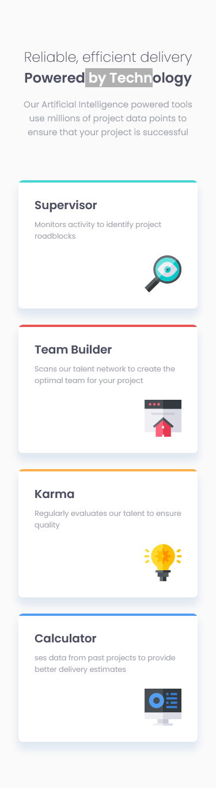
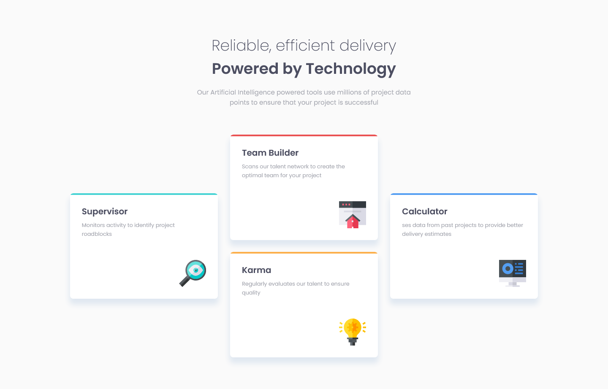

# Frontend Mentor - Four card feature section solution

This is a solution to the [Four card feature section challenge on Frontend Mentor](https://www.frontendmentor.io/challenges/four-card-feature-section-weK1eFYK). Frontend Mentor challenges help you improve your coding skills by building realistic projects.

## Table of contents

- [Overview](#overview)
  - [The challenge](#the-challenge)
  - [Screenshot](#screenshot)
  - [Links](#links)
- [My process](#my-process)
  - [Built with](#built-with)
  - [What I learned](#what-i-learned)
  - [Useful resources](#useful-resources)
- [Author](#author)

## Overview

### The challenge

Users should be able to:

- View the optimal layout for the site depending on their device's screen size

### Screenshot

- Mobile View

  

- Desktop View

  

### Links

- Solution URL: [Github](https://github.com/asdiAdi/four-card-feature-section)
- Live Site URL: [Vercel](https://four-card-feature-section-five-beta.vercel.app/)

## My process

### Built with

- Semantic HTML5 markup
- CSS custom properties
- CSS Grid
- Responsive Web design
- Mobile-first workflow

### Useful resources

- [w3schools](https://www.w3schools.com/) - I used this for extensively for reference.
- [MDN Docs](https://developer.mozilla.org/en-US/) - Another great site for reference.
- [Grid](https://css-tricks.com/snippets/css/complete-guide-grid/) - Useful grid reference.learning this concept.

## Author

- LinkedIn - [@asdiAdi](https://www.linkedin.com/in/asdiAdi/)
- Github - [@asdiAdi](https://github.com/asdiAdi)
- Frontend Mentor - [@asdiAdi](https://www.frontendmentor.io/profile/asdiAdi)
- Freecodecamp = [@asdiAdi](https://www.freecodecamp.org/asdiAdi)
